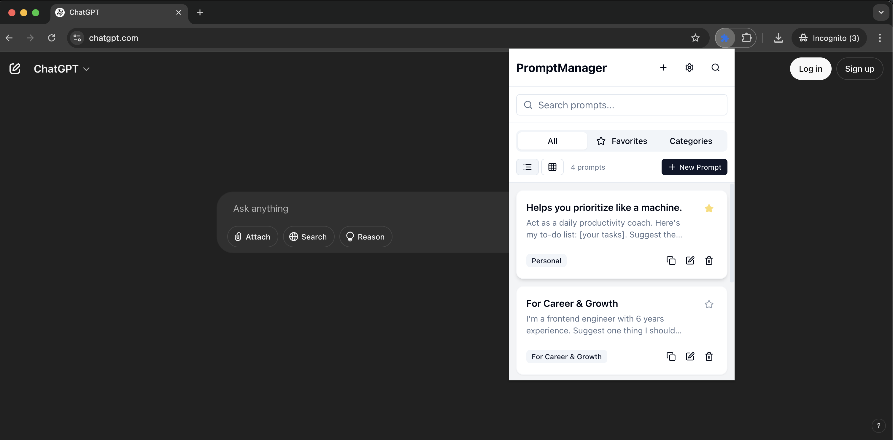
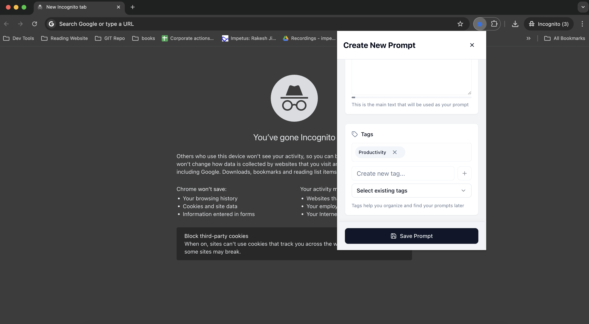
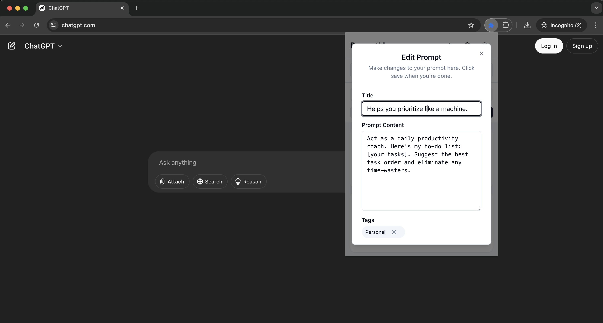
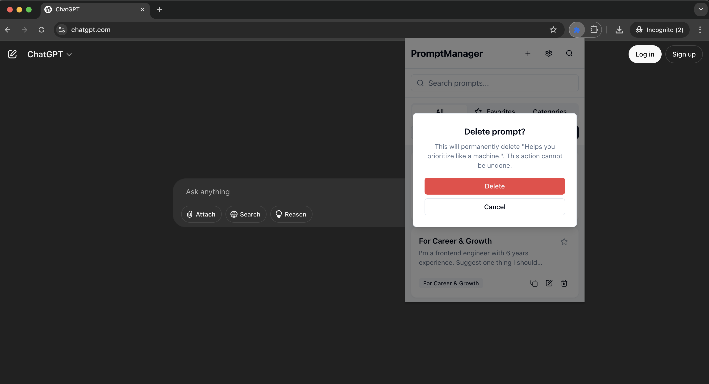
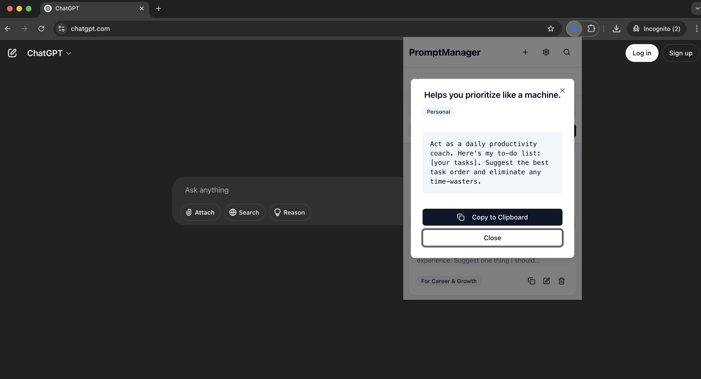

# Prompt Manager Chrome Extension

A powerful Chrome extension for managing and reusing text prompts with optional Notion integration. Built with React, TypeScript, and Tailwind CSS.

## Features

- Store and manage text prompts
- Quick access to frequently used prompts
- Clipboard integration for easy copying
- Optional Notion integration
- Modern and intuitive UI
- Dark/Light mode support

## Screenshots

### Main Interface

*View and manage all your prompts in one place*

### Adding New Prompts

*Easily create new prompts with a clean interface*

### Filtering and Search

*Quickly find the prompt you need with powerful filtering*

### Managing Prompts

*Edit existing prompts with a simple interface*


*Safely remove prompts you no longer need*

### Viewing Prompts

*View prompt details in a clean, readable format*

## Installation

### From Chrome Web Store (Coming Soon)

1. Visit the Chrome Web Store
2. Search for "Prompt Manager"
3. Click "Add to Chrome"

### Manual Installation

1. Clone this repository:
   ```bash
   git clone https://github.com/ryadav96/ai-prompt-manager.git
   ```

2. Install dependencies:
   ```bash
   pnpm install
   ```

3. Build the extension:
   ```bash
   pnpm build:ext
   ```

4. Load the extension in Chrome:
   - Open Chrome and navigate to `chrome://extensions/`
   - Enable "Developer mode" in the top right
   - Click "Load unpacked" and select the `dist` directory from the project

## Development

### Prerequisites

- Node.js (v18 or higher)
- pnpm (package manager)

### Available Scripts

- `pnpm dev` - Start development server
- `pnpm build` - Build the extension
- `pnpm build:ext` - Build the extension with manifest and icons
- `pnpm format` - Format code with Prettier
- `pnpm lint` - Run ESLint
- `pnpm test` - Run tests
- `pnpm test:coverage` - Run tests with coverage

## Project Structure

```
├── src/              # Source code
├── public/           # Static assets
│   ├── icons/        # Extension icons
│   └── manifest.json # Extension manifest
├── components/       # React components
├── dist/            # Build output
└── package.json     # Project configuration
```

## Technologies Used

- React
- TypeScript
- Tailwind CSS
- Vite
- Radix UI
- React Hook Form
- Zod

## Contributing

Contributions are welcome! Please feel free to submit a Pull Request.

1. Fork the repository
2. Create your feature branch (`git checkout -b feature/amazing-feature`)
3. Commit your changes (`git commit -m 'Add some amazing feature'`)
4. Push to the branch (`git push origin feature/amazing-feature`)
5. Open a Pull Request

## License

This project is licensed under the MIT License - see the [LICENSE](LICENSE) file for details.

## Support

If you find this extension helpful, please consider giving it a star on GitHub! 