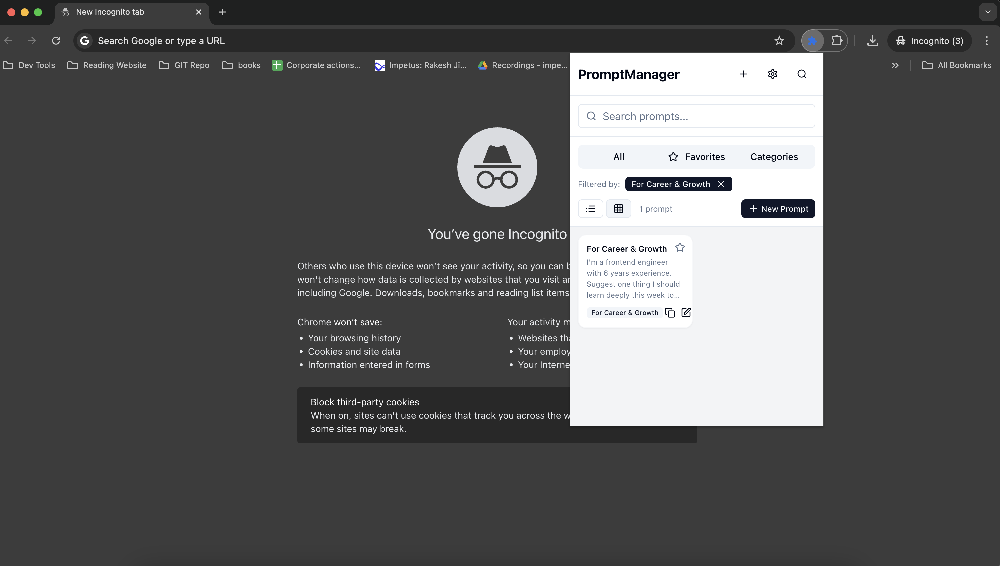

# Prompt Manager Chrome Extension

A powerful Chrome extension for managing and reusing text prompts with optional Notion integration. Built with React, TypeScript, and Tailwind CSS.

## Features

- Store and manage text prompts
- Quick access to frequently used prompts
- Clipboard integration for easy copying
- Optional Notion integration
- Modern and intuitive UI
- Dark/Light mode support

## Screenshots

### Main Interface


_View and manage all your prompts in one place_

### Adding New Prompts


_Easily create new prompts with a clean interface_

### Filtering and Search


_Quickly find the prompt you need with powerful filtering_

### Managing Prompts


_Edit existing prompts with a simple interface_


_Safely remove prompts you no longer need_

### Viewing Prompts


_View prompt details in a clean, readable format_

## 🚀 Upcoming Features

- [x] **Add Prompt via Context Menu**  
      Quickly add new prompts directly from the right-click context menu.

- [ ] **Notion Integration**  
      Seamlessly sync and manage your prompts within Notion.
      (Coming soon!)
- [ ] **Import & Export Prompts**  
      Easily back up and transfer your prompt library.
      (Coming soon!)

- [ ] **Cross-Browser Support**  
      Extend compatibility to Chrome, Firefox, Edge, and more.
      (Coming soon!)

- [ ] **Prompt Color Coding**  
      Organize and identify prompts faster with custom color tags.

- [ ] **Smart Suggestions**  
      Get intelligent prompt recommendations based on your usage patterns.

## Installation

<!-- https://chromewebstore.google.com/detail/prompt-manager/ecgpejhpjiednknijpjeindhohflaibf?authuser=0&hl=en-GB -->

### From Chrome Web Store

1. Open the [Chrome Web Store](https://chrome.google.com/webstore/detail/prompt-manager/ecgpejhpjiednknijpjeindhohflaibf)
2. Click "Add to Chrome"
3. Confirm the installation by clicking "Add extension"
4. Once installed, you can find the extension icon in the Chrome toolbar.

### Manual Installation

1. Clone this repository:

   ```bash
   git clone https://github.com/ryadav96/ai-prompt-manager.git
   ```

2. Install dependencies:

   ```bash
   pnpm install
   ```

3. Build the extension:

   ```bash
   pnpm build:ext
   ```

4. Load the extension in Chrome:
   - Open Chrome and navigate to `chrome://extensions/`
   - Enable "Developer mode" in the top right
   - Click "Load unpacked" and select the `dist` directory from the project

## Development

### Prerequisites

- Node.js (v18 or higher)
- pnpm (package manager)

### Available Scripts

- `pnpm dev` - Start development server
- `pnpm build` - Build the extension
- `pnpm build:ext` - Build the extension with manifest and icons
- `pnpm format` - Format code with Prettier
- `pnpm lint` - Run ESLint
- `pnpm test` - Run tests
- `pnpm test:coverage` - Run tests with coverage

## Project Structure

```
├── src/              # Source code
├── public/           # Static assets
│   ├── icons/        # Extension icons
│   └── manifest.json # Extension manifest
├── components/       # React components
├── dist/            # Build output
└── package.json     # Project configuration
```

## Technologies Used

- React
- TypeScript
- Tailwind CSS
- Vite
- Radix UI
- React Hook Form
- Zod

## Contributing

Contributions are welcome! Please feel free to submit a Pull Request.

1. Fork the repository
2. Create your feature branch (`git checkout -b feature/amazing-feature`)
3. Commit your changes (`git commit -m 'Add some amazing feature'`)
4. Push to the branch (`git push origin feature/amazing-feature`)
5. Open a Pull Request

## License

This project is licensed under the MIT License - see the [LICENSE](LICENSE) file for details.

## Support

If you find this extension helpful, please consider giving it a star on GitHub!
